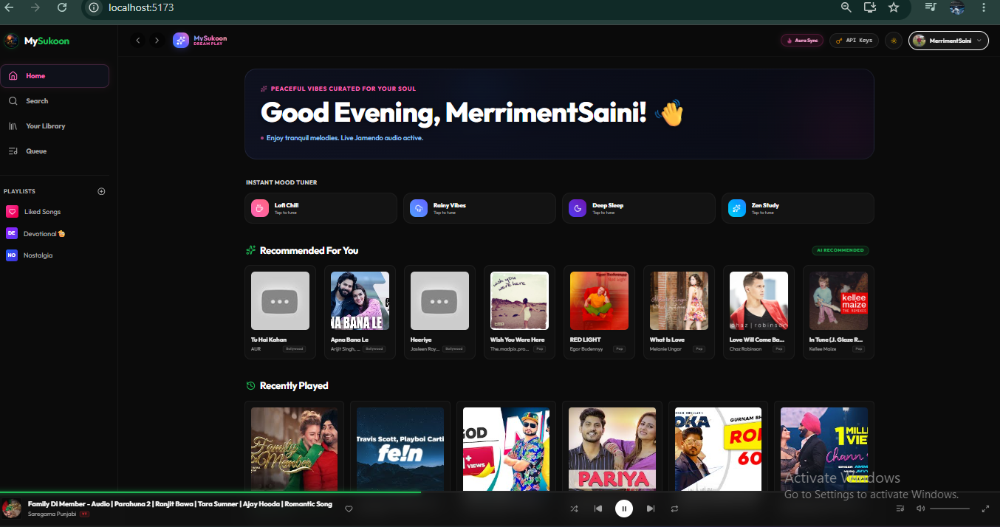
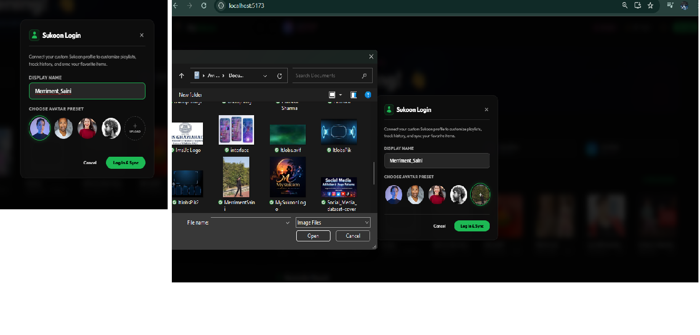
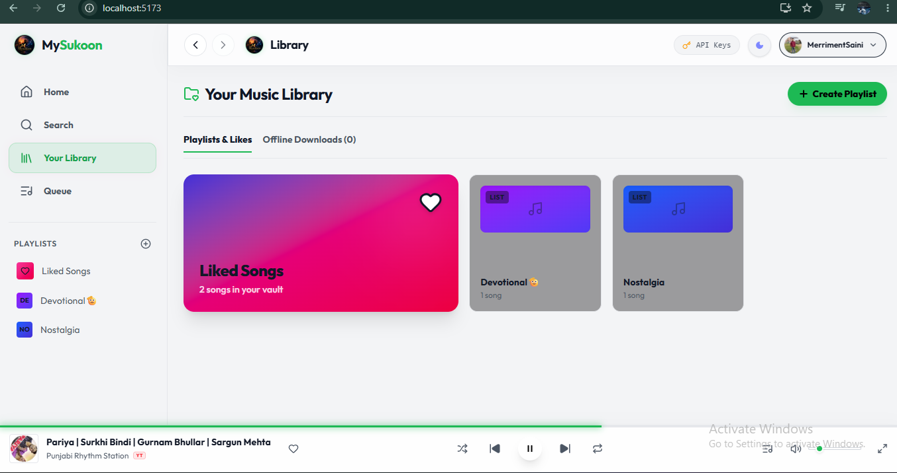
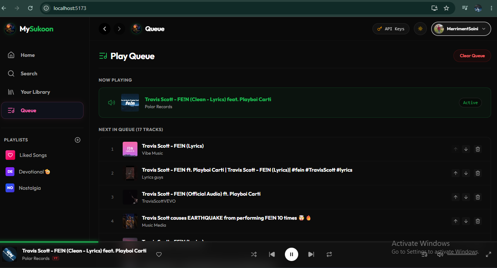
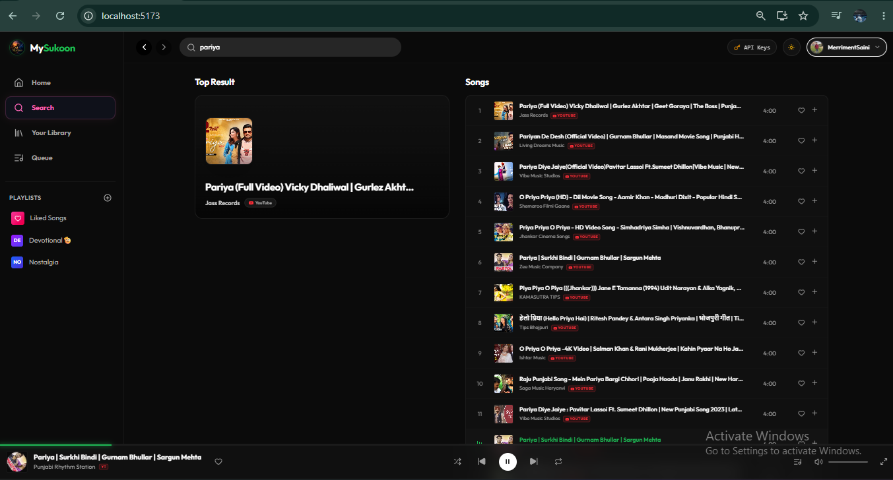
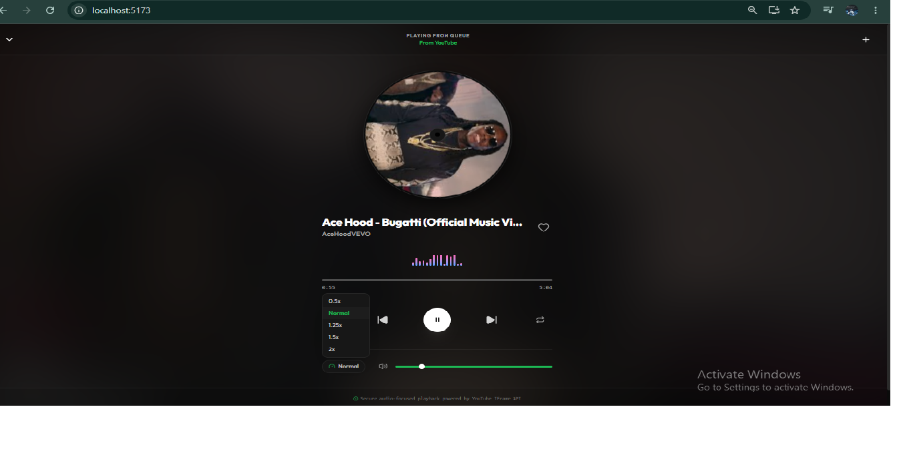

---------- 🎵 MySukoon Music Player ----------

A modern music player built with React, Vite, Node.js, and the Jamendo API.

## ✨ Features
- 🎵 Stream music
- 🔍 Search songs and artists
- ❤️ Favorites
- 📂 Playlists
- 🌙 Responsive UI
- ⚡ Fast loading

## 🛠 Tech Stack
- React
- Vite
- JavaScript
- Node.js
- Jamendo API

## 🚀 Installation

npm install

npm run dev

## 📸 Application Screenshots

### 🏠 Home Page..!

### 🔐 Login Page..!

### 📂 Playlist Page..!

### 🎵 Queue Page..!

### 🔎 Search Page..!

### ▶️ Song Player..!

## 📄 License

MIT

Created By: Avi Saini | BCA Student
Aspirant: App/Web Development | Python Developer | Django Learner 
